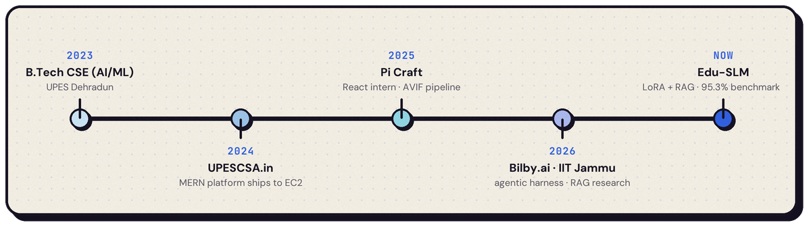
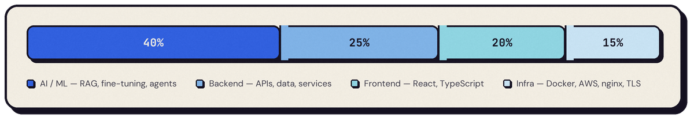

> I take work through to something **running in production**, not a prototype. Most of it is agentic systems, retrieval and fine-tuning; the rest is the backend and infrastructure that keeps them up. I build with AI coding assistants as standard practice — and exercise judgement on what they generate before it ships.
>
> B.Tech CSE (AI/ML), UPES Dehradun &nbsp;·&nbsp; CGPA 8.14/10 &nbsp;·&nbsp; 2023–2027 &nbsp;·&nbsp; Jammu, India

**Bilby.ai** &nbsp;·&nbsp; Intern &nbsp;&nbsp;Remote (Hong Kong) &nbsp;·&nbsp; Jun 2026 – Jul 2026

Reverse-engineered a SOTA **agentic harness** and its developer tooling — MCP-based tool integration, context-management strategy, and tool-orchestration workflows across multiple systems. Authored the comparative research and decks that let the team weigh design trade-offs and commit to tooling decisions.

`MCP` `Agentic Architecture` `Systems Analysis` `Technical Writing`

**IIT Jammu** &nbsp;·&nbsp; Research Intern &nbsp;&nbsp;Hybrid &nbsp;·&nbsp; Jun 2026 – Jul 2026

Built a **privacy-preserving agentic pipeline** with strict data-access guardrails — it generates database algorithms autonomously without ever exposing raw data to the LLM. Researched knowledge contradictions in RAG pipelines, designing and evaluating conflict-resolution strategies that surface model failure modes *before* downstream use.

`RAG Evaluation` `Guardrails` `Fact Verification` `GRPO`

**Pi Craft** &nbsp;·&nbsp; Web Developer Intern &nbsp;&nbsp;Remote &nbsp;·&nbsp; Jun 2025 – Jul 2025

Built the company site in **React.js** on reusable components, with AVIF asset optimisation that measurably improved page load across devices.

`React` `Performance` `Frontend`

 

<table>
<tr>
<td valign="top" width="50%">

### Edu-SLM
Domain-specific educational language model

Fine-tuned LLaMA and Qwen on an Operating Systems curriculum using **RAG-assisted knowledge distillation** with LoRA. FAISS retrieval over semantic embeddings, fed by a synthetic dataset generated from academic sources. Designed for institution-side deployment: low-cost inference, no student data leaving the building.

**95.3%** on a 655-MCQ benchmark &nbsp;·&nbsp; measurably reduced hallucination

`Python` `PyTorch` `LLaMA` `Qwen` `LoRA/PEFT` `RAG` `FAISS`

</td>
<td valign="top" width="50%">

### [UPESCSA.in](https://upescsa.in)
Event & content platform &nbsp;·&nbsp; live in production

Full MERN platform handling event registration, dynamic content and technical operations. The deployment is hand-rolled: shell scripts that provision Docker, configure nginx as a reverse proxy and issue Let's Encrypt TLS certs, so a redeploy is one command instead of a checklist.

**Live on AWS EC2** &nbsp;·&nbsp; Docker + nginx + Certbot

`MongoDB` `Express` `React` `Node.js` `Docker` `Nginx` `AWS EC2`

</td>
</tr>
<tr>
<td valign="top" width="50%">

### Agentic Fact-Checking Platform
Automated news verification pipeline

An agentic pipeline that decomposes a news article into individually verifiable claims, gathers evidence through automated web search and scraping, then scores credibility claim by claim. Prompts are seeded and versioned in MongoDB rather than hardcoded, and results are cached to cut latency.

**Claim → evidence → scored verdict** &nbsp;·&nbsp; prompt versioning

`Python` `FastAPI` `Groq LLMs` `React` `TypeScript` `MongoDB`

</td>
<td valign="top" width="50%">

### [TheGeetaWay](https://thegeetaway.streamlit.app)
AI guidance portal &nbsp;·&nbsp; deployed

Semantic search and RAG over Bhagavad Gita verses. Llama 3 generates responses grounded in the verses actually retrieved rather than free-associating, through a FAISS retrieval pipeline with sentence-transformer embeddings.

**Verse-grounded generation** &nbsp;·&nbsp; FAISS vector retrieval

`Python` `FastAPI` `Streamlit` `FAISS` `Sentence Transformers` `Llama 3`

</td>
</tr>
</table>

  

<table>
<tr>
<td valign="top" width="50%">

**Achievements**

- **SIH 2025** — Top 5 teams, Smart India Hackathon internal round
- **AWS Community Day Dehradun 2025** — ran cross-team technical and operational coordination for 100+ participants
- **UPES Hackathon 4.0** — led problem-statement design and evaluation for a national-level event

</td>
<td valign="top" width="50%">

**Certifications**

- [**Software Engineer**](https://www.hackerrank.com/certificates/77beaf00239a) — HackerRank
- [**Python (Basic)**](https://www.hackerrank.com/certificates/1582c0cf1cc0) — HackerRank
- [**Claude Code 101**](https://academy.claude.com/verify/2f3e4b938b3d34771bc8b3239bf20b68) — Anthropic Academy

</td>
</tr>
</table>

Open to conversations about agentic systems, retrieval, and backend engineering.
  

