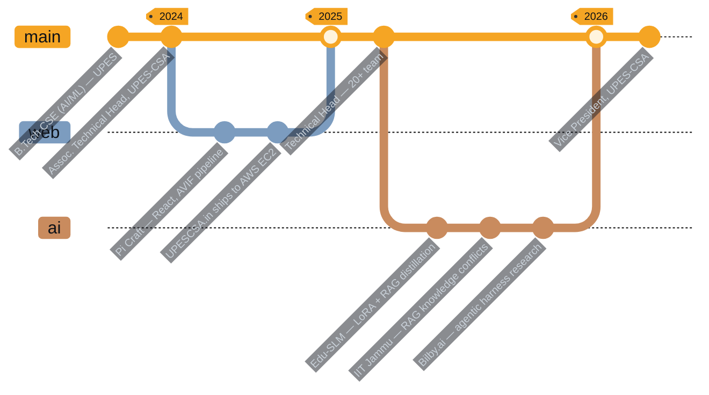
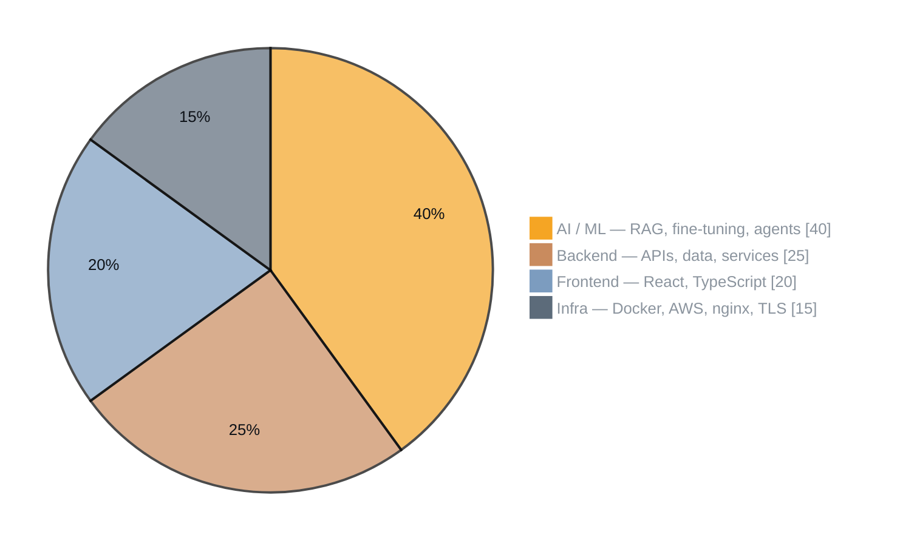
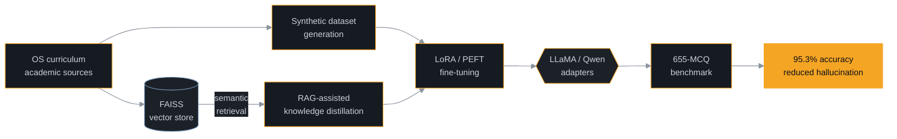
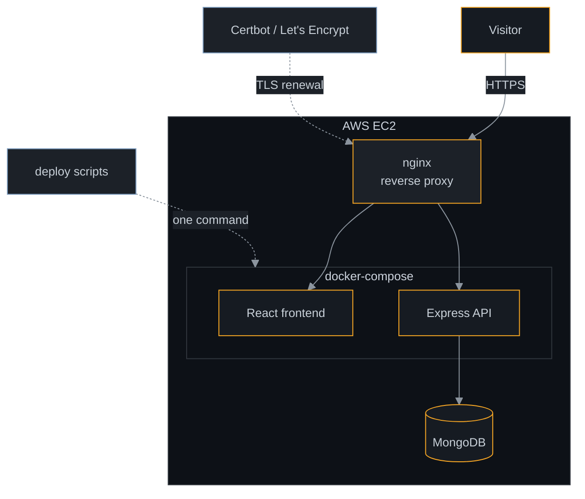

<h1 align="center">Rudra Gupta</h1>

<p align="center">
<a href="https://byrudra.vercel.app"></a>
<a href="mailto:rudra.gupta@hotmail.com"></a>
<a href="https://linkedin.com/in/rudra-gupta"></a>
<a href="https://github.com/byRudra"></a>
</p>

<p align="center">

</p>

<p align="center">
<sub><b>Jammu, India</b> &nbsp;·&nbsp; B.Tech CSE (AI/ML), UPES Dehradun &nbsp;·&nbsp; CGPA 8.14/10 &nbsp;·&nbsp; 2023–2027</sub>
</p>

> Full-stack engineer and Vice President of UPES-CSA, leading a 50+ member technical chapter.
> I pick up unfamiliar stacks quickly and take work through to something **running in production**, not a prototype.
> I build with AI coding assistants as standard practice — and exercise judgement on what they generate before it ships.

---

## The Path So Far



---

## Experience

<table>
<tr>
<td width="34%" valign="top">

**Bilby.ai** &nbsp;`Intern`

<sub>Remote — Hong Kong<br/>Jun 2026 – Jul 2026</sub>

</td>
<td valign="top">

Reverse-engineered a SOTA **agentic harness** and its developer tooling — MCP-based tool integration, context-management strategy, and tool-orchestration workflows across multiple systems.

Authored the comparative technical research and decks that let the team weigh design trade-offs and commit to tooling decisions.

`MCP` `Agentic Architecture` `Systems Analysis` `Technical Writing`

</td>
</tr>
<tr>
<td valign="top">

**IIT Jammu** &nbsp;`Research Intern`

<sub>Hybrid<br/>Jun 2026 – Jul 2026</sub>

</td>
<td valign="top">

Built a **privacy-preserving agentic pipeline** with strict data-access guardrails — it generates database algorithms autonomously without ever exposing raw data to the LLM.

Researched knowledge contradictions in RAG pipelines, designing and evaluating conflict-resolution strategies that surface model failure modes *before* downstream use.

`RAG Evaluation` `Guardrails` `Fact Verification` `GRPO`

</td>
</tr>
<tr>
<td valign="top">

**Pi Craft** &nbsp;`Web Developer Intern`

<sub>Remote<br/>Jun 2025 – Jul 2025</sub>

</td>
<td valign="top">

Built the company site in **React.js** on reusable components, with AVIF asset optimisation that measurably improved page load across devices.

`React` `Performance` `Frontend`

</td>
</tr>
</table>

### Leadership — UPES-CSA (Cloud Security Alliance)

<table>
<tr>
<td align="center" width="33%">

**Vice President**

<sub>May 2026 – Present</sub>

Leading a **50+ member** chapter across technical, events and outreach teams.

</td>
<td align="center" width="33%">

**Technical Head**

<sub>May 2025 – Apr 2026</sub>

Mentored a **20+ member** team as lead developer of UPESCSA.in.

</td>
<td align="center" width="33%">

**Assoc. Technical Head**

<sub>May 2024 – Apr 2025</sub>

Mentored **12+** core members; led problem design for UPES Hackathon 4.0.

</td>
</tr>
</table>

---

## Where the Work Actually Sits



---

## Stack

<div align="center">

<table>
<tr>
<td align="center" width="110"><br/><sub>Python</sub></td>
<td align="center" width="110"><br/><sub>PyTorch</sub></td>
<td align="center" width="110"><br/><sub>TypeScript</sub></td>
<td align="center" width="110"><br/><sub>React</sub></td>
<td align="center" width="110"><br/><sub>Node.js</sub></td>
<td align="center" width="110"><br/><sub>Express</sub></td>
<td align="center" width="110"><br/><sub>FastAPI</sub></td>
</tr>
<tr>
<td align="center" width="110"><br/><sub>MongoDB</sub></td>
<td align="center" width="110"><br/><sub>MySQL</sub></td>
<td align="center" width="110"><br/><sub>Redis</sub></td>
<td align="center" width="110"><br/><sub>Docker</sub></td>
<td align="center" width="110"><br/><sub>AWS EC2</sub></td>
<td align="center" width="110"><br/><sub>Nginx</sub></td>
<td align="center" width="110"><br/><sub>Linux</sub></td>
</tr>
</table>

<br/>

**AI / ML / NLP**


**Infrastructure & Tooling**


</div>

---

## Selected Work

<table>
<tr>
<td valign="top" width="50%">

### Edu-SLM
<sub>Domain-Specific Educational Language Model</sub>

`Python` `PyTorch` `LLaMA` `Qwen` `LoRA/PEFT` `RAG` `FAISS`

Fine-tuned LLaMA and Qwen on an Operating Systems curriculum using **RAG-assisted knowledge distillation** with LoRA. FAISS vector retrieval over semantic embeddings, fed by a synthetic dataset generated from academic sources.

```
95.3%  accuracy on a 655-MCQ benchmark
       measurably reduced hallucination
       low-cost · privacy-first · institution-grade
```

</td>
<td valign="top" width="50%">

### [UPESCSA.in](https://upescsa.in)
<sub>Official UPES-CSA Platform &nbsp;·&nbsp; live in production</sub>

`MongoDB` `Express` `React` `Node.js` `Docker` `Nginx` `AWS EC2`

Full MERN platform for event registration, content management and technical operations for a 50+ member chapter — maintained across three committee terms.

Deployment is **hand-rolled**: shell scripts that provision Docker, configure nginx as a reverse proxy, and issue Let's Encrypt TLS certs, cutting a redeploy to one command.

```
Live · AWS EC2 · Docker + nginx + Certbot
Single-command redeploy pipeline
```

</td>
</tr>
<tr>
<td valign="top" width="50%">

### Agentic Fact-Checking Platform
<sub>Automated news verification pipeline</sub>

`Python` `FastAPI` `Groq LLMs` `React` `TypeScript` `MongoDB`

An agentic pipeline that decomposes a news article into individually verifiable claims, gathers evidence via automated web search and scraping, then scores credibility claim by claim.

Prompts are **seeded and versioned in MongoDB** rather than hardcoded; results are cached to cut latency. React frontend renders the verdicts.

```
Claim decomposition → evidence → scored verdict
Prompt versioning · result caching
```

</td>
<td valign="top" width="50%">

### [TheGeetaWay](https://thegeetaway.streamlit.app)
<sub>AI Guidance Portal &nbsp;·&nbsp; deployed</sub>

`Python` `FastAPI` `Streamlit` `FAISS` `Sentence Transformers` `Llama 3`

Semantic search and RAG over Bhagavad Gita verses. Llama 3 generates responses grounded in retrieved verses rather than free-associating, via a FAISS retrieval pipeline.

```
FAISS vector retrieval
Verse-grounded generation
```

</td>
</tr>
</table>

<details>
<summary><b>How the Edu-SLM pipeline is put together</b> &nbsp;·&nbsp; <sub>click to expand</sub></summary>

<br/>



**The idea:** a small, institution-deployable model that answers curriculum questions without shipping student data to a third-party API. Retrieval grounds the distillation step, so the adapter learns the curriculum rather than memorising surface phrasing — which is what pushed hallucination down on the held-out MCQ set.

</details>

<details>
<summary><b>What the UPESCSA.in deploy pipeline does</b> &nbsp;·&nbsp; <sub>click to expand</sub></summary>

<br/>



Provisioning, reverse-proxy config, TLS issuance and separate hardened frontend/backend deploy paths are all scripted — so a redeploy is one command rather than a checklist.

</details>

---

## Signals

<div align="center">


<br/>


<br/><br/>


<br/><br/>

<sub><b>CONTRIBUTION ACTIVITY</b></sub>


</div>

---

## Recognition

<table>
<tr>
<td width="50%" valign="top">

**Achievements**

- **SIH 2025** — Top 5 teams, Smart India Hackathon internal round
- **AWS Community Day Dehradun 2025** — ran cross-team technical and operational coordination for 100+ participants
- **UPES Hackathon 4.0** — led problem-statement design and evaluation for a national-level event

</td>
<td width="50%" valign="top">

**Certifications**

- [**Software Engineer**](https://www.hackerrank.com/certificates/77beaf00239a) — HackerRank
- [**Python (Basic)**](https://www.hackerrank.com/certificates/1582c0cf1cc0) — HackerRank
- [**Claude Code 101**](https://academy.claude.com/verify/2f3e4b938b3d34771bc8b3239bf20b68) — Anthropic Academy

</td>
</tr>
</table>

---

<div align="center">

<sub>Open to conversations about agentic systems, retrieval, and backend engineering.</sub>

<br/><br/>

<a href="https://byrudra.vercel.app"></a>


</div>
